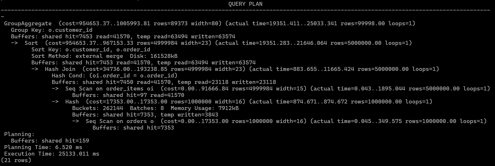
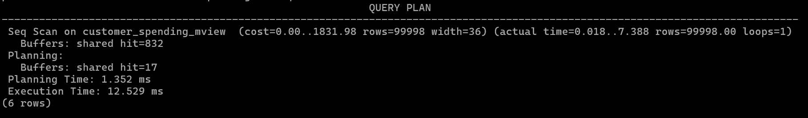

# Test 10: Materialized Views

### Objective

- Evaluate how Materialized Views improve query performance by storing precomputed results of expensive analytical queries.
- Compare **`Live Aggregation Query`** vs **`Materialized View Query`**.

---

### Live Aggregation 

```sql
EXPLAIN (ANALYZE, BUFFERS)
SELECT
    o.customer_id,
    COUNT(DISTINCT o.order_id) AS total_orders,
    SUM(oi.amount) AS total_spent,
    AVG(oi.amount) AS avg_item_amount
FROM orders o
JOIN order_items oi
ON o.order_id = oi.order_id
GROUP BY o.customer_id;
```

**Description:**
This query calculates aggregate metrics (total orders, total spent, average item amount) by joining the `orders` and `order_items` tables and grouping by customer.

### Result



### Metrics

|Metric|Value|
|---|---|
|Scan Type|GroupAggregate|
|Join Type|Hash Join|
|Sort Method|External Merge|
|Execution Time|25133.011 ms|
|Planning Time|6.520 ms|
|Shared Hits|7453|
|Shared Reads|41570|
|Temp Reads|63494|
|Temp Writes|63574|
|Rows Returned|99998|

### Observations

- Very high execution time (`25.1 seconds`) indicates an expensive aggregation workload.
- **Hash Join** processed 5 million rows, making it the costliest operation.
- Heavy **temporary I/O** (`63K+ reads/writes`) increased query latency.
- High table scan cost due to reading millions of rows from both tables.
- **Sequential scans** were used on `orders` and `order_items` tables.
- **External Merge Sort** spilled to disk because available memory was insufficient.

---

### Materialized View

Create Materialized View:
```sql
CREATE MATERIALIZED VIEW customer_spending_mview AS
SELECT
    o.customer_id,
    COUNT(DISTINCT o.order_id) AS total_orders,
    SUM(oi.amount) AS total_spent,
    AVG(oi.amount) AS avg_item_amount
FROM orders o
JOIN order_items oi
ON o.order_id = oi.order_id
GROUP BY o.customer_id;
```

Run query:
```sql
EXPLAIN (ANALYZE, BUFFERS)
SELECT *
FROM customer_spending_mview;
```

### Result



### Metrics

| Metric | Value |
|---|---|
| Scan Type | Sequential Scan |
| Execution Time | 12.529 ms |
| Planning Time | 1.352 ms |
| Shared Hits | 832 |
| Shared Reads | 0 |
| Rows Returned | 99,998 |

### Observations

- Execution time dropped dramatically from 25.1 s to 12.5 ms.
- Precomputed results in the materialized view eliminated expensive joins and aggregation.
- No temporary disk I/O was required.
- All data was served from cache (832 shared hits, 0 reads).
- A simple sequential scan on the materialized view was sufficient to return all 99,998 rows.

---

### Sample Query Result

| customer_id | total_orders | total_spent |    avg_item_amount
------------|--------------|-------------|-----------------------
|           1 |           13 |   311491.02 | 4719.5609090909090909
|           2 |            6 |   147361.89 | 5081.4444827586206897
|           3 |            6 |    93914.06 | 4695.7030000000000000
|           4 |           14 |   322481.43 | 4673.6439130434782609
|           5 |            9 |   186788.23 | 4789.4417948717948718

---

### Refresh Materialized View

```sql
REFRESH MATERIALIZED VIEW customer_spending_mview;
```

- This command is used to update the materialized view with the latest data from the underlying tables. 
- Since a materialized view stores a precomputed snapshot of query results, any changes made to orders or order_items are not reflected automatically. 
- Running `REFRESH MATERIALIZED VIEW` recomputes the view so that queries return current and accurate results.

---

### Performance Improvement

**Execution Time**:
$$
\frac{25133.011}{12.529} \approx 2005.6
$$

Result: Materialized View improves query performance by approximately **2005.6x**.

**Buffer Activity**:

Live aggregation required:
```sql
Shared Reads     : 41,570
Temp Reads       : 63,494
Temp Writes      : 63,574
```
Materialized View required:
```sql
Shared Reads     : 0
Temp Reads       : 0
Temp Writes      : 0
```
This significantly reduced disk and temporary file activity.

---

### Quick Overview

#### Materialized View

A **Materialized View** is a database object that stores the result of a query physically on disk. Unlike a regular view, it does not recompute the query every time, making complex aggregations and joins much faster to query

---

#### Temp I/O

**Temporary I/O (Temp Reads/Writes)** occurs when PostgreSQL cannot fit intermediate query data into memory and must use temporary files on disk. High Temp I/O usually indicates memory-intensive operations and can slow down query execution.

---

#### External Merge Spill

An **External Merge Spill** happens when a sort operation exceeds the available `work_mem`. PostgreSQL writes portions of the data to disk and performs an external merge sort, which is slower than an in-memory sort due to additional disk I/O.

---

### Key Findings

- Materialized Views store precomputed query results, eliminating the need for repeated expensive computations.
- They are particularly effective for analytical queries involving joins, aggregations, and complex calculations.
- Refreshing the materialized view ensures data consistency with underlying tables.
- The performance improvement comes at the cost of storage space and the need for periodic refreshes.